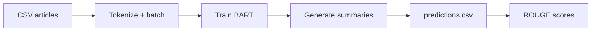

<div align="center">

# News Summarization using BART

**Abstractive news summarization** with a BART sequence-to-sequence model (PyTorch + Hugging Face).

[](https://www.python.org/)
[](https://pytorch.org/)
[](https://huggingface.co/docs/transformers)
[](LICENSE)

[Features](#-features) · [Quick start](#-quick-start) · [Project layout](#-project-layout) · [Notebook flow](#-notebook-flow)

</div>

---

## Overview

This repository trains and evaluates **BART** (`BartForConditionalGeneration`) to turn long **BBC-style news articles** into short **reference-aligned summaries**. Training, inference, and **ROUGE** scoring run in a single Jupyter notebook so you can experiment end-to-end without extra scripts.

| Input | Output |
|--------|--------|
| Full article text (`Text`) | Generated summary vs. gold `Summary` |

Preprocessing prepends a task prefix: `summarize: <article>` to steer the seq2seq model.

---

## Features

- Fine-tuning with teacher forcing and padded-label masking (`-100` on pad tokens).
- Beam search decoding for inference (`model.generate`).
- **ROUGE** via Hugging Face [`evaluate`](https://huggingface.co/docs/evaluate) (`rouge1`, `rouge2`, `rougeL`, `rougeLsum`).
- Optional **Weights & Biases** logging and optional **push to Hugging Face Hub** (configured in the notebook).
- Results exported to `results/predictions.csv` for inspection or reporting.

---

## Quick start

```bash
git clone https://github.com/Shini0404/News-Summarization-using-BART.git
cd News-Summarization-using-BART
python -m venv .venv
```

**Windows (PowerShell)**

```powershell
.\.venv\Scripts\Activate.ps1
pip install -r requirements.txt
```

**macOS / Linux**

```bash
source .venv/bin/activate
pip install -r requirements.txt
```

Open `notebooks/BART_transformer_summarization.ipynb` and run all cells **from top to bottom**.

> **Paths:** Data is loaded as `../data/BBCarticles.csv` and predictions are written to `../results/predictions.csv` relative to the notebook folder—keep that layout or update the paths in the notebook.

---

## Project layout

```
News-Summarization-using-BART/
├── data/
│   └── BBCarticles.csv          # Text + Summary pairs
├── notebooks/
│   └── BART_transformer_summarization.ipynb
├── readme_visuals/              # Supporting figures (optional for docs)
├── results/
│   └── predictions.csv          # Generated after you run inference
├── requirements.txt
└── README.md
```

---

## Dataset

| Column | Description |
|--------|-------------|
| `Text` | Full news article |
| `Summary` | Target summary |

The notebook reads the CSV with `encoding='latin-1'` to handle special characters safely.

---

## Default training settings (notebook)

These are defined in the notebook via **Weights & Biases** `config`; adjust there for your runs.

| Setting | Typical value (notebook) |
|---------|---------------------------|
| Train / eval batch size | 2 |
| Epochs | 2 |
| Learning rate | 1e-4 |
| Max source length | 512 |
| Max summary length | 150 |
| Data split | Small random fraction for quick experiments (see notebook) |

The pretrained checkpoint used in the notebook is loaded from the Hugging Face Hub as configured there (namespace/repo name appears in the notebook cells).

---

## Notebook flow

1. Imports, device selection (`cuda` if available).
2. Optional: `wandb.login()` and Hugging Face Hub login.
3. Hyperparameters and reproducibility seeds.
4. Load `BBCarticles.csv`, prefix inputs, sample train/eval splits.
5. `CustomDataset` + `DataLoader` with BART tokenizer.
6. Load model, `Adam` optimizer, training loop.
7. `model.generate` on the eval loader → decode strings.
8. Save `results/predictions.csv`.
9. Compute ROUGE with `evaluate.load("rouge")`.



---

## Results

After a full run, open **`results/predictions.csv`**: columns **`predictions`** (model) and **`actuals`** (gold). ROUGE scores are printed in the last evaluation cells.

---

## Optional integrations

| Tool | Purpose |
|------|---------|
| **Weights & Biases** | Loss and experiment tracking (`wandb.init`, `wandb.watch`) |
| **Hugging Face Hub** | Push tokenizer/model (`push_to_hub`) |

Disable or skip the login cells if you only want local training.

---

## Customization ideas

- Use a larger train fraction and more epochs for production-quality summaries.
- Replace the random subsample split with a fixed **train / validation / test** split.
- Tune generation: `num_beams`, `max_length`, `repetition_penalty`, `length_penalty`.
- Try a strong baseline such as `facebook/bart-large-cnn` for comparison.
- Add a small CLI or Gradio app for one-off article summarization.

---

## Requirements

See [`requirements.txt`](requirements.txt): `numpy`, `pandas`, `torch`, `transformers`, `evaluate`, `wandb`.

The notebook also uses **`huggingface_hub`** for login—install if missing:

```bash
pip install huggingface_hub
```

---

## Acknowledgments

News-article summarization data in **BBC-style** paired format; [**Hugging Face Transformers**](https://huggingface.co/transformers); [**PyTorch**](https://pytorch.org/); optional tooling from [**Weights & Biases**](https://wandb.ai/).

---

<div align="center">

**Maintained by [Shini0404](https://github.com/Shini0404)**

</div>
